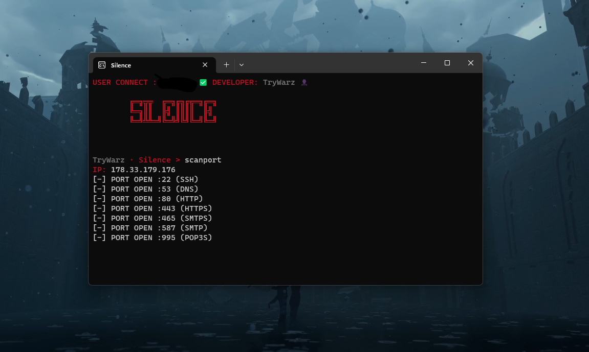

# Silence ScanPort

Python program that scans a target IP address for open ports. It uses the socket library to create a TCP connection to each port in a specified range and checks if the connection is successful. If a connection is established, the script identifies the service associated with the open port using a dictionary of well-known port numbers and their corresponding services. The script takes the target IP address as a command-line argument and can be customized with optional arguments for the port range and timeout.

## Installation
```
pip install colorama
````


## Application


## Fonctions

### `class Configuration`

Class representing the configuration for scanning ports.

#### `__init__(self, ip_address, start_port=1, end_port=65535, timeout=0.04)`

Class constructor

- `ip_address`: IP address to be scanned.
- `start_port`: Start port for scan (default 1).
- `end_port`: End port for scan (default 65535).
- `timeout`: Connection timeout (default 0.04).

#### `scan_ports(self)`

Method for scanning ports.

Returns : List of open ports with their service name.

## Variables

### `PORT_SERVICES`

Dictionary that associates port numbers with their service name.

## Exécution

```bash
python main.py
````
